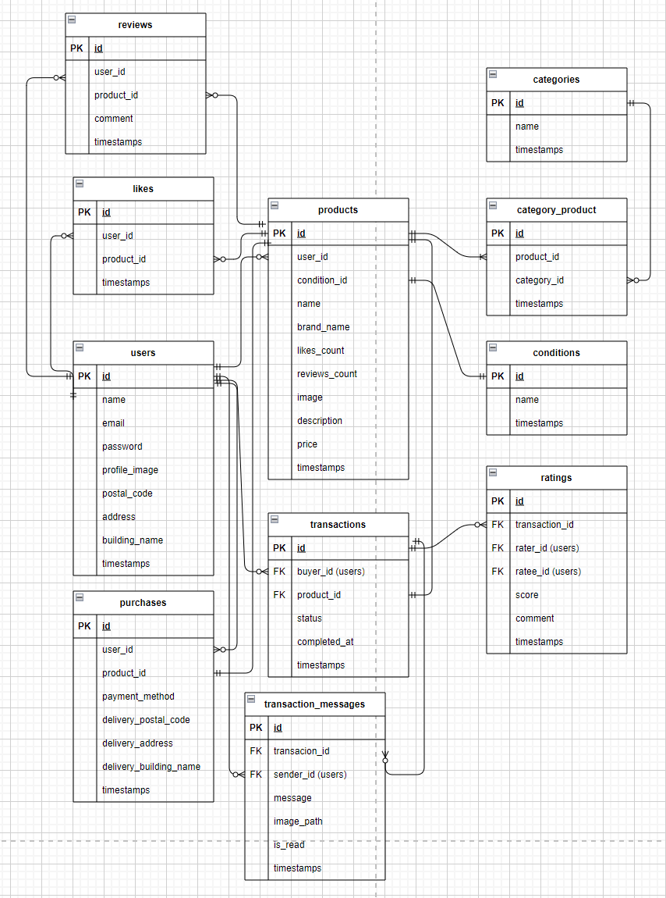

# free-market__app

## 環境構築
### Dockerビルド
1. git clone git@github.com:akanainoue/free-market__app.git
2. docker-compose up -d --build

### Laravel環境構築
1. docker-compose exec php bash
2. composer install
3. cp .env.example .env 
   「.env.example」ファイルを 「.env」ファイルに命名を変更。または、新しく.envファイルを作成
4. .envに以下の環境変数を追加
    DB_CONNECTION=mysql
    DB_HOST=mysql
    DB_PORT=3306
    DB_DATABASE=laravel_db
    DB_USERNAME=laravel_user
    DB_PASSWORD=laravel_pass

    MAIL_MAILER=smtp
    MAIL_HOST=mailhog
    MAIL_PORT=1025
    MAIL_USERNAME=null
    MAIL_PASSWORD=null
    MAIL_ENCRYPTION=null
    MAIL_FROM_ADDRESS=info@example.com
    MAIL_FROM_NAME="${APP_NAME}"

    STRIPE_KEY=your_stripe_key
    STRIPE_SECRET=your_stripe_secret

    BROADCAST_DRIVER=pusher

    FILESYSTEM_DRIVER=public

    PUSHER_APP_ID=your_app_id
    PUSHER_APP_KEY=your_app_key
    PUSHER_APP_SECRET=your_app_secret
    PUSHER_APP_CLUSTER=ap3

5. アプリケーションキーの作成
    php artisan key:generate

6. マイグレーションの実行
    php artisan config:clear
    php artisan cache:clear
    php artisan config:cache
    php artisan migrate

7. シーディングの実行
    php artisan db:seed

8. シンボリックリンク作成
    php artisan storage:link

9. npm install && npm run dev
   chmod -R 777 storage bootstrap/cache
   chown -R www-data:www-data storage bootstrap/cache
10. http://localhost/register から会員登録
    
### 新機能とセットアップ
 チャット機能（リアルタイム対応）
### 使用技術
+ PHP8.3.0
+ Laravel8.83.27
+ MySQL8.0.26
+ Stripe を使って決済処理を実装
+ Laravel のメール通知（ユーザー認証・通知）に MailHog を使用
## チャット機能（リアルタイム対応）　
+ Laravel Echo
+ Pusher（BROADCAST_DRIVER）
+ JavaScript + WebSocket

## ER図

## URL
+ 開発環境：http://localhost/
+ phpMyAdmin:：http://localhost:8080/
+ Mailhog: http://localhost:8025

